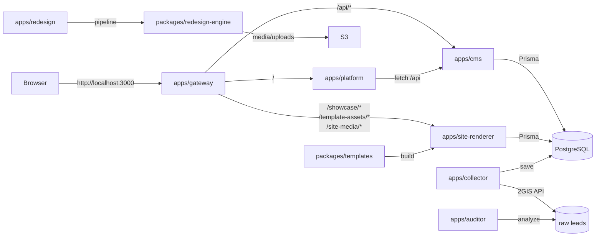

# WebsiteLeadAgent (MVP)

## Product terminology

| Product area | What it is | Canonical URL | Legacy aliases |
| --- | --- | --- | --- |
| **Hub** | Product entry point for SUPER_ADMIN | `http://localhost:3000` | — |
| **Radar** | Lead qualification and Factory start | `/radar` | `/leads` |
| **Forge** | Generated sites dashboard | `/forge` | `/sites` |
| **Studio** | Site CMS editor | `/studio/:siteId` | `/cms?site=:siteId` |
| **Showcase** | Customer preview site | `/showcase/:previewToken` | `/preview/:previewToken` |
| **Factory** | Redesign pipeline (runs inside CORE) | — | — |
| **Gate** | Single-port reverse proxy | `http://localhost:3000` | — |
| **CORE** | Platform API | `http://localhost:3333` | — |
| **STUDIO** | CMS service | `http://localhost:3335` | — |
| **ENGINE** | Site renderer | `http://localhost:3336` | — |
| **POSTGRES** | Database | `localhost:5433` | — |

## Architecture & Technical Dive

### 1. Service mesh

The product is a TypeScript monorepo built around an API Gateway that routes public traffic to the right internal service. Each app is a separate service; shared code and the site template live in `packages/`.



### 2. Monorepo layout

```
websiteLeadAgent/
├── apps/                 # runnable services
│   ├── auditor/          # lead scoring, lighthouse, visual audit
│   ├── cms/              # headless CMS API (Express + Prisma)
│   ├── collector/        # 2GIS lead scraper CLI
│   ├── dashboard/        # minimal admin status server
│   ├── gateway/          # reverse proxy for local dev
│   ├── platform/         # React platform UI (Radar, Forge, Studio)
│   ├── redesign/         # redesign pipeline CLI
│   └── site-renderer/    # SSR site renderer for Showcase previews
├── packages/             # shared libraries
│   ├── content-schema/   # CMS content type definitions
│   ├── design-brief/     # design brief generation
│   ├── media-storage/    # S3 / local media helpers
│   ├── redesign-engine/  # AI redesign pipeline
│   ├── screenshot/       # screenshot capture helpers
│   └── templates/        # React-based site themes
│       └── src/construction-modern-v1/
│           ├── index.ts  # SSR entry: loads __CMS__ and serves HTML
│           ├── main.tsx  # client entry: hydrate React
│           ├── App.tsx   # page components and router
│           └── index.css # Tailwind base styles
├── prisma/               # Prisma schema and migrations
│   ├── schema.prisma     # source of truth for Site, Page, NewsPost, etc.
│   └── migrations/
├── scripts/              # development and QA automation
│   ├── dev.ts            # single-command dev launcher
│   ├── link-crawler.ts   # Playwright link audit
│   ├── news-qa.ts        # News edit round-trip test
│   ├── project-service-qa.ts
│   ├── edit-roundtrip.ts
│   └── backfill-garant.ts
├── docs/                 # reports and screenshots
├── tests/                # Vitest specs
├── output/               # CLI output (leads.json, generated HTML)
└── docker-compose.yml    # PostgreSQL only
```

### 3. Applications (`apps/`)

| App | Runtime | Responsibility |
| --- | --- | --- |
| `apps/gateway` | Express | Single-port reverse proxy. Routes `/api/*`, `/showcase/*`, `/template-assets/*`, `/site-media/*` and the SPA to the right backend. |
| `apps/cms` | Express | Headless CMS API. Auth, CRUD for `Site`, `Page`, `NewsPost`, `Project`, `Service`, `Vacancy`, `MenuItem`, `Media`, `User`. |
| `apps/platform` | Vite/React | Customer-facing platform: `Login`, `Radar` (leads, providers, presets, history), `Forge`, `Studio`. |
| `apps/site-renderer` | Express | Fetches a site, CMS entities and the correct template, then renders `window.__CMS__` into `packages/templates/.../index.html`. |
| `apps/collector` | Node CLI | Scrapes 2GIS for leads. Outputs `output/leads.json` and `output/leads.csv`. |
| `apps/auditor` | Node CLI | Audits/scores sites and leads (`lighthouse`, `score`, `visual-analyze`). |
| `apps/redesign` | Node CLI | CLI wrapper around `packages/redesign-engine`. |
| `apps/dashboard` | Express | Platform API / CORE. Auth, discovery provider/preset management, discovery runs, webhooks and platform health. |

### 4. Packages (`packages/`)

| Package | Responsibility |
| --- | --- |
| `packages/templates` | Vite-built React themes. `construction-modern-v1` is the current template. `index.ts` is the SSR entry; `App.tsx` is the client router. |
| `packages/redesign-engine` | AI-driven redesign pipeline that generates a `Design` and can backfill CMS content. |
| `packages/content-schema` | Zod/JSON schemas for CMS entities. |
| `packages/design-brief` | Brief generation from lead/site context. |
| `packages/media-storage` | S3-compatible upload/presign helpers. |
| `packages/screenshot` | Playwright screenshot capture utilities used by QA scripts. |

### 5. Database & content model

- **DB**: PostgreSQL (`localhost:5433` default).
- **ORM**: Prisma (`prisma/schema.prisma`).
- **Key models**:
  - `Site` — the generated customer site.
  - `SiteSettings` — company data, contacts, domain.
  - `Page` — generic CMS pages (`about`, `contacts`, `objects`, `services`, `news`, `vacancies`, `index`).
  - `NewsPost`, `Project`, `Service`, `Vacancy` — structured collections.
  - `Media` — uploaded images.
  - `MenuItem` — navigation tree (label, url, pageId, sortOrder, visible).
  - `Lead`, `SiteUser`, `User` — auth and lead management.
  - `DiscoveryProviderConfig`, `DiscoveryPreset`, `DiscoveryRun`, `DiscoverySetting` — discovery sources, presets, runs and defaults.

### 6. Template rendering pipeline

1. **Build time**: `packages/templates` runs `vite build`, producing `dist/construction-modern-v1/public/` (static JS/CSS and `index.html`).
2. **Runtime**: `apps/site-renderer` gets a request like `/showcase/:previewToken/about`.
3. **Data load**: it fetches the `Site`, `SiteSettings`, published `Page`s, `Project`s, `Service`s, `NewsPost`s, `Vacancy`s, `MenuItem`s and `Media` from Prisma.
4. **Payload construction**: `packages/templates/src/construction-modern-v1/index.ts` turns raw DB rows into `window.__CMS__` with `NAV`, `PAGES`, `SERVICES`, `PROJECTS`, `NEWS_ITEMS`, `VACANCIES`.
5. **Hydration**: the browser receives `index.html` with the payload; `main.tsx` mounts `App.tsx`, which uses `__CMS__.route` and `__CMS__.subRoute` to render `PageView`, `ProjectList`, `ServiceDetail`, etc.

### 7. Example request flow — opening `/showcase/8e25ix7c/about`

1. Browser → `apps/gateway` on `3000`.
2. `gateway` recognizes `/showcase/*` and proxies to `apps/site-renderer` on `3336`.
3. `site-renderer` finds the site by `previewToken`, extracts `route = about` and `subRoute = undefined`.
4. Prisma loads the published `Page` with `slug = about` plus all other CMS entities.
5. `packages/templates/.../index.ts` builds `__CMS__` and sets `route: 'about'`.
6. `App.tsx` renders `PageView` because `route` is not a known collection and `PAGES` contains the `about` page.

### 8. Development pipeline

- `npm run dev` — starts PostgreSQL (if needed), CORE/STUDIO/ENGINE/HUB/GATE and builds the template.
- `npm run dev -- --no-infra` — assumes PostgreSQL is already running.
- `npm run db:migrate` — runs Prisma migrations.
- `npm run infra:reset` — wipes and recreates the local database.
- Vitest for unit tests: `npm run test`.

### 9. QA & automation

| Script | Purpose |
| --- | --- |
| `scripts/link-crawler.ts` | Crawls 7 public Showcase routes and classifies every `<a>` (`VALID_INTERNAL`, `EXTERNAL`, `PLACEHOLDER`, `BROKEN`, …). |
| `scripts/news-qa.ts` | Studio → Showcase round-trip for News. |
| `scripts/project-service-qa.ts` | Round-trip for Projects and Services. |
| `scripts/edit-roundtrip.ts` | Basic multi-site edit verification. |
| `scripts/screenshot-qa.ts` | Captures visual smoke tests. |
| `scripts/discovery-qa.ts` | End-to-end test for New Discovery, presets and discovery history. |
| `scripts/providers-qa.ts` | Verifies provider cards, configuration, test flow, presets CRUD and unconfigured CTA. |

### 10. Discovery & provider configuration flow

Discovery is driven by **BusinessDiscoveryProvider** implementations registered in `apps/dashboard/src/discovery/registry.ts`. Each provider exposes `meta` (capabilities, credentials), `isConfigured(env)` and `search(request, context)`.

```
Radar UI ──/radar/providers──> CORE (apps/dashboard)
CORE ──> DiscoveryService
DiscoveryService ──> Prisma: DiscoveryProviderConfig / DiscoveryPreset
DiscoveryService ──> BusinessDiscoveryProvider.search()
BusinessDiscoveryProvider ──> 2GIS / Yandex / DuckDuckGo / OSM / manual input
```

- **Status & configuration**: `DiscoveryService.listProviders()` computes `READY`, `NOT_CONFIGURED`, `DISABLED`, `ERROR` or `UNAVAILABLE` by checking the persisted `DiscoveryProviderConfig`, the provider's `isConfigured(env)` result and recent test results.
- **Testing**: `POST /api/discovery/providers/:id/test` runs a safe search on the server, records `lastTestStatus`/`lastTestMessage` and never returns secrets to the browser.
- **Presets**: `DiscoveryPreset` rows replace hard-coded topic presets; the UI at `/radar/presets` supports create, edit, delete, enable/disable and default provider/location/limit.
- **New Discovery**: `/radar/providers` and the `NewDiscovery` modal pre-select the chosen provider. If it is not configured, the UI shows a **Configure provider** CTA.

### 11. Security notes

- Provider credentials are stored only in `process.env` on CORE.
- The `DiscoveryProviderConfig` model persists `enabled`, `defaults` and test metadata, but never the secret itself.
- Auth and super-admin checks on `/api/discovery/*` live in `apps/dashboard/src/server.ts` middleware.

## Requirements

- Node.js 22+
- Docker + Docker Compose

## Setup

1. Install dependencies

```bash
npm install
```

2. Create `.env`

```bash
cp .env.example .env
```

Set:

- `DGIS_API_KEY`
- `DATABASE_URL`

3. Start PostgreSQL

```bash
docker compose up -d
```

4. Migrate database

```bash
npm run db:migrate
```

## Local development

### Quick start (full product)

No flags are required — `npm run dev` starts the entire product on `http://localhost:3000`:

```bash
npm install
cp .env.example .env   # fill DGIS_API_KEY etc. as needed
npm run dev
```

Then open:

- `http://localhost:3000/radar` — Radar (lead qualification)
- `http://localhost:3000/forge` — Forge (generated sites)
- `http://localhost:3000/studio/<siteId>` — Studio (CMS)
- `http://localhost:3000/showcase/<previewToken>` — Showcase (customer preview)

### Available flags

Run `npm run dev:help` (or `npm run dev -- --help`) to see all options.

| Command | What it starts |
| --- | --- |
| `npm run dev` | Everything: PostgreSQL (if not running), CORE, STUDIO, ENGINE, HUB, and GATE on `http://localhost:3000` |
| `npm run dev -- --only=platform` | Platform API, Platform Web, and Gateway |
| `npm run dev -- --only=cms` | CMS, auth, and Gateway |
| `npm run dev -- --only=renderer` | Renderer and Gateway |
| `npm run dev -- --skip=cms` | Full product except the CMS |
| `npm run dev -- --no-infra` | Use this when PostgreSQL is already running (e.g. after `npm run infra:up`) |

### Infrastructure commands

```bash
npm run infra:up    # start PostgreSQL only
npm run infra:down  # stop PostgreSQL
npm run infra:reset # wipe local data and recreate
```

### Internal ports

- CORE (Platform API): `3333`
- STUDIO (CMS): `3335`
- ENGINE (Renderer): `3336`
- HUB (Platform web): `3004`
- GATE (Gateway): `3000`

## Collect leads (2GIS)

```bash
npm run leads -- --city="Минск" --query="ремонт квартир" --limit=50
```

Outputs:

- `output/leads.json`
- `output/leads.csv`
